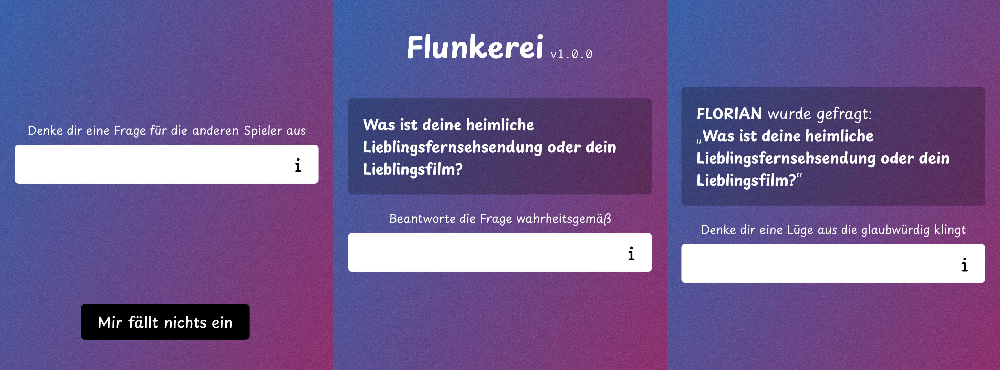

# Flunkerei

> A game all about lying - heavily inspired by the Jackbox Party Pack game "Fibbage: Enough About You"

Uncover truths and fabrications as players reveal personal anecdotes and craft convincing lies. With new rounds adding twists and turns, it's not just about what you know, but who you can fool!



## Getting Started

Install the [Node.js v20](https://nodejs.org/en/) runtime and the [pnpm](https://pnpm.io/) package manager.

```
# Arch Linux
pacman -S nodejs-lts-iron
```

```
corepack enable
corepack prepare pnpm@latest --activate
```

Install the dependencies

```
pnpm install
```

Spin up the client

```
cd client
pnpm dev
```

Spin up the server

```
cd server
pnpm dev
```

Visit [localhost:5173](http://localhost:5173) in your browser and start playing!

## Local Multiplayer

If you want to play with friends within the same network, you will need to change some settings.

> [!NOTE]
> As soon as we have implemented a gateway server, these steps will no longer be necessary.
> A well known gateway server will then handle communication between clients and servers without the need for manual configuration.

1. Find out your local IP address
1. Open the `client/.env` file and change the `VITE_API_BASE_URL` to `http://<your-ip>:3000`
1. Launch the client with the `--host` flag to allow outside connections
1. Launch the server as usual
1. Let your friends connect via `http://<your-ip>:5173`
